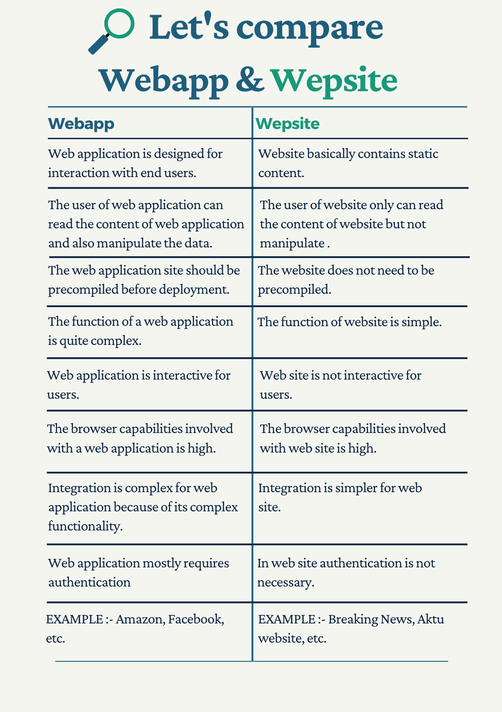

# Webframes for building apps in python 

---

## Khalid Alharthi

### I specialize in wasting time in trivial stuff
### Misk Dsi
### Team 3

<!-- .slide: style="text-align: left;"> -->
<i class="fas fa-envelope"></i>  alhartkh@gmail.com 
<i class="fab fa-github"></i><a href="https://github.com/alhartkh">  github.com/alhartkh</a>

---

## Objectives
<!-- .slide: style="text-align: left;"> -->
* Define webframes (aka web frameowkrs or web development framework "WDF")
* Understand the difference between frameworks & libraries
* Understand the difference between websites & webapps
* Contrast the types of frameowkrs
* Classify Python webframes types
* Compare Python popular webframes  
* Construct a simple webapp using flask 

---

## Agenda
<!-- .slide: style="text-align: left;"> -->
- Background 
- Demonistration 
- Summary 
- Q&A 

---

## Background 

---

## What are web frames?
<!-- .slide: style="text-align: left;"> -->
"A web development framework is a set of resources and tools for software developers to build and manage web applications, web services and websites" 
<a href="https://searchcontentmanagement.techtarget.com/definition/web-development-framework-WDF">https://searchcontentmanagement.techtarget.com/definition/web-development-framework-WDF</a> 

---

## What is the difference between a framework and a library?
## & 
## What is the the difference between a website and a webapp?

---

## Difference between libraries and frameworks
<!-- .slide: style="text-align: left;"> -->
- **Library** : It performs a set of  specific and well-defined operations. Examples : Network protocols, compression, image manipulation, string utilities, regular expression evaluation, math etc 
- **Framework**: It is known to be a skeleton where the application defines the content of the operation by filling out the skeleton. The framework only defines the concept but an application further defines the functionality that is useful for end-users 

------

- **Inversion of control**: When we call a method from a library, we are in control. But in framework, the control is inverted i.e. the framework calls us 
<a href="https://www.geeksforgeeks.org/software-framework-vs-library/
https://www.freecodecamp.org/news/the-difference-between-a-framework-and-a-library-bd133054023f/">https://www.geeksforgeeks.org/software-framework-vs-library/
https://www.freecodecamp.org/news/the-difference-between-a-framework-and-a-library-bd133054023f/
</a> 

------

- **Library Examples** : Network protocols, compression, image manipulation, string utilities, regular expression evaluation, math etc 
- **Framework Examples**:  Web application system, Plug-in manager, GUI system 

---

### Difference between a website and a webapplication

---

### Difference between front-end and back-end frameworks
<!-- .slide: style="text-align: left;"> -->
- **Back-End** : 
  - The frontend is the part of the website visible to the users. </a> 
  - Backend Languages: Python, JavaScript, PHP, Ruby, .NET 
  - Backend frameworks: Django, Ruby On Rails, Express, Spring, ASP.NET Core 
- **Front-End** : 
  - The frontend is the part of the website visible to the users. 
  - Frontend Languages: HTML, CSS, JavaScript, JQuery 
  - Frontend Frameworks: React, Vue, BootStrap, Ember, Angular 
  
 ---
 
 ### Types of python webframe works 
 <!-- .slide: style="text-align: left;"> -->
1. **Full Stack Framework** : Full stack are one of the best Python web application frameworks, known as one-stop-solution for fulfilling all kinds of app building requirements. 
2. **Micro-Framework**: These kinds of web frameworks are known as the lightweight framework (non full stack framework) because they do not offer additional patterns and functionalities compared to a full stack framework. 
3. **Asynchronous Framework** : Asynchronous web frameworks are now taking over its place as a microframeworks that allows a user to handle large sets of concurrent connections. 

------

## Examples

1. **Full Stack Framework**: 
  - Django
  - Pyramid
2. **Micro-Framework**: 
  - Bottle
  - CherryPy
  - Falcon
  - Flask
3. **Asynchronous Framework**: 
  - AIOHTTP
  - Tornado

---

## Demonistration

---

## Flask Webapp Code

<pre><code data-line-numbers="1|3|5-7|9-11|13-14">from flask import Flask, render_template
# Starting the app by calling Flask
app = Flask(__name__)
# First: Start the root website from the "/", the first page
# Second: Name the route "index"
# Third: Reference the index.html file
@app.route('/')
def index():
    return render_template('index.html')
# First: Start the website from the "/ar", the second page
# Second: Name the route "/ar"
# Third: Reference the ar.html file
@app.route('/ar')
def ar():
    return render_template('ar.html')
# Run the web server and the app
# '0.0.0.0' ==> The web app is accissible by any device on the local network
if __name__ == '__main__':
    app.run(debug=True, host='0.0.0.0')
    
</pre></code>

---

## http://127.0.0.1:5000/

